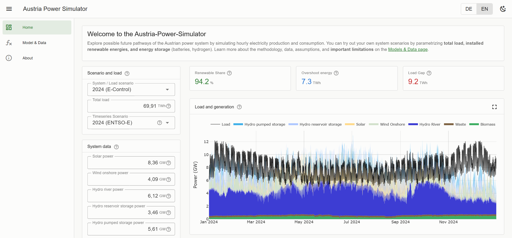

# Austria Power Simulator

An interactive, browser-based tool for simulating hourly electricity production and
consumption in Austria's power system. Explore future renewable pathways by adjusting
installed capacities, storage technologies and demand scenarios — and see the resulting
energy balance, renewable share and storage dynamics update as you type.



**Live demo:** [bethadata.github.io/austria-power-sim](https://bethadata.github.io/austria-power-sim/)

---

## Features

- **Hourly simulation** of an entire year (8 760 time steps) — supply–demand matching with storage dispatch, recomputed on every parameter change
- **Configurable generation mix** — solar PV, wind onshore, hydro run-of-river, hydro reservoir, pumped hydro, biomass, waste
- **Two storage technologies** — battery storage and hydrogen (electrolyser → storage → back-conversion), each mounted only while it is switched on
- **Multiple scenarios** — historical capacities (2023–2025) and TYNDP 2024 future pathways
- **Key performance indicators** — renewable share (%), annual overshoot and load gap (TWh)
- **Interactive Plotly charts** — load and generation, annual energy balance, storage state of charge, residual load duration curve; each expandable to fullscreen
- **Sticky control rail** — the inputs stay on screen beside the chart they move
- **Bilingual** — German and English
- **Static deployment** — runs entirely in the browser, no server and no API keys

---

## Tech Stack

| Category | Library / Tool | Version |
|---|---|---|
| Framework | [Vue 3](https://vuejs.org/) | 3.5 |
| Language | TypeScript | ~5.9 |
| Build tool | [Vite](https://vitejs.dev/) | 8 |
| UI components | [Vuetify](https://vuetifyjs.com/) | 4 |
| Charts | [Plotly.js](https://plotly.com/javascript/) (basic bundle) | 3.7 |
| Routing | Vue Router (hash mode) | 5 |
| i18n | Vue I18n | 11 |
| Icons | Material Design Icons | 7 |

---

## Getting Started

Requires [Node.js](https://nodejs.org/) 22 or newer.

```bash
git clone https://github.com/bethadata/austria-power-sim.git
cd austria-power-sim
npm install
npm run dev          # http://localhost:5173
```

Other scripts:

```bash
npm run build        # type-check + production build
npm run typecheck
npm run preview      # serves dist/ on :4176
npm run test:smoke   # headless browser assertions, exits non-zero on failure
```

## Project Structure

```
austria-power-sim/
├── public/                     # favicon set and webmanifest, served as-is
├── src/
│   ├── main.ts                 # entry point — registers plugins
│   ├── App.vue                 # shell: app bar, navigation drawer, v-main
│   ├── router/index.ts         # routes (/, /model, /about), hash mode
│   ├── i18n.ts                 # Vue I18n configuration
│   ├── plugins/vuetify.ts      # light and dark theme tokens
│   ├── styles/app.css          # root type size and the heading margin reset
│   ├── declarations.d.ts       # vuetify/styles, __BUILD_DATE__
│   ├── composables/
│   │   ├── useModel.ts         # the simulation: module-scope state + hourly dispatch
│   │   ├── usePlotly.ts        # chart colour, series naming, shared layout
│   │   ├── usePlotPanel.ts     # draw targets, resize, theme redraw, fullscreen
│   │   └── useAppTheme.ts      # theme choice, persisted
│   ├── views/
│   │   ├── HomeView.vue        # control rail + results grid
│   │   ├── ModelView.vue       # model documentation and limitations
│   │   └── AboutView.vue       # about, privacy and disclaimer
│   ├── components/
│   │   ├── layout/AppFooter.vue
│   │   ├── ui/                 # PanelCard, HelpIcon — the chrome every panel wears
│   │   ├── model/              # input forms, KPI tiles, Plotly panels
│   │   └── sections/           # IntroCard, BottomInfo
│   ├── utils/links.ts          # outbound URLs, in one place
│   ├── locales/{de,en}/        # about, home and model strings per locale
│   └── data/
│       ├── timeseries_2023.json  # normalised hourly profiles — 2023
│       ├── timeseries_2024.json  #   "                          2024
│       ├── timeseries_2025.json  #   "                          2025
│       ├── powers.json           # installed capacities per scenario (GW)
│       ├── loads.json            # annual demand per scenario (TWh)
│       └── energies.json         # annual generation reference data (TWh)
├── tools/smoke.mjs               # headless browser test
├── .github/workflows/deploy.yml  # build and deploy to GitHub Pages
├── vite.config.ts
└── package.json
```

The `src/data/` JSON is prepared offline from ENTSO-E, E-Control and energy-charts
exports. Those preparation scripts and their source workbooks are local-only and are not
part of this repository.

---

## The Simulation Model

The core engine lives in `src/composables/useModel.ts`. It runs a full year of hourly
dispatch as a single pass over 8 760 steps, driven by reactive Vue state.

### What is simulated

1. **Generation scaling** — installed capacities (GW) are applied to hourly profiles normalised per GW of capacity, giving actual generation time series.
2. **Residual load** — total demand minus total renewable generation, each hour.
3. **Battery dispatch** — charges on excess generation, discharges to cover residual load, within its energy (GWh) and power (GW) limits.
4. **Hydrogen dispatch** — an electrolyser converts excess electricity to hydrogen at 70 % efficiency; a gas turbine converts it back at 50 %. Dispatched after the battery, on the residual the battery leaves.
5. **Load gap and overshoot** — unmet demand and excess generation that could not be stored, accumulated over the year.

Power is in GW, energy in TWh, and one time step is one hour throughout.

### Data sources

| Data | Source |
|---|---|
| Hourly generation profiles | [ENTSO-E Transparency Platform](https://transparency.entsoe.eu/) |
| Installed capacities (historic) | [E-Control Austria](https://www.e-control.at/) |
| Installed capacities (future scenarios) | [TYNDP 2024](https://tyndp.entsoe.eu/) |
| Dashboard / validation | [energy-charts.info](https://energy-charts.info/) |

### Known limitations

- No cross-border electricity exchange (Austria only, closed system)
- Copper-plate assumption — no internal grid constraints
- Reservoir hydro is not dispatched; its fill level is carried through for display only
- No sector coupling (heat pumps, EVs, industry) and no hydrogen demand from transport or industry
- No demand-side flexibility or vehicle-to-grid
- Behind-the-meter PV self-consumption not accounted for
- The renewable share is an annual energy ratio, not a time-matched self-sufficiency figure, and can exceed 100 %

Full documentation is on the **Model & Data** page of the running application.

---

## Related projects

Two sibling dashboards, same stack and same conventions:

- [Austria Transition Tracker](https://bethadata.github.io/austria-transition-tracker-v2/) — energy transition and emissions
- [Austria Population Tracker](https://bethadata.github.io/austria-population-tracker/) — population by region, 2002 to today

---

## Contributing

Feedback, bug reports and pull requests are welcome. Please open an issue first for larger
changes, so the approach can be discussed.

---

## Licence

MIT — see [LICENSE](LICENSE).

---

## About

Developed by **bethadata**. The tool is intended for educational and illustrative
purposes; it is not a certified planning tool.

The code and some descriptive texts were developed with assistance from AI tools (ChatGPT,
Claude Code). All outputs have been reviewed and verified by the author.
